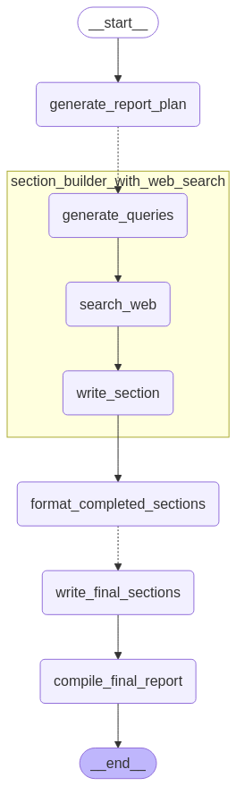

# DeepResearch AI

FastAPI 백엔드 서버, LangGraph 및 다중 에이전트(Multi-Agent) 아키텍처를 기반으로 구축된 최첨단 AI 기반 리서치 보고서 자동 생성 시스템입니다. 자동화된 연구 계획 수립, 웹 검색(Web Research) 및 구조화된 보고서 생성을 지원하며, Bootstrap 5 및 Jinja2 템플릿을 활용한 완전한 서버 사이드 렌더링(SSR) UI를 제공합니다.



## 🚀 개요

DeepResearch AI는 강력한 다중 에이전트 프레임워크를 통해 전체 조사 및 종합 과정을 동적으로 관리합니다. LangGraph 오케스트레이션을 활용하여 스스로 복잡한 상태를 관리하며 최적의 쿼리(Query)를 구성하고, 웹을 크롤링하며 문서의 문맥을 완벽히 이해하는 보고서를 조합합니다. 전체 레포트 생성 프로세스는 Server-Sent Events(SSE)를 통해 클라이언트 UI와 실시간으로 통신하며 진행 상황을 렌더링하고, 완벽한 PDF 변환 엔진과 AWS S3 저장 기능을 보조 파이프라인으로 처리합니다.

## ✨ 주요 기능

- **다중 에이전트 아키텍처 (Multi-Agent)**: 순차적 및 병렬 태스크 오케스트레이션을 위한 LangChain과 LangGraph 구조 기반 설계.
- **FastAPI 프레임워크**: 동기(Sync) 및 비동기(Async) 작업을 매끄럽게 연결하는 고성능 백엔드 라우팅 구조.
- **실시간 스트리밍 처리 (SSE)**: LangGraph 노드의 동작 상태와 진행도를 실시간으로 프론트엔드와 연결하여 매끄러운 UX 제공.
- **스토리지 및 데이터베이스 인프라**: 관계형 데이터베이스(SQLAlchemy)와 객체 스토리지(boto3 / AWS S3)를 모두 결합하여 영속적 데이터 저장 및 리소스 관리 체계화.
- **보안 및 인증 파이프라인**: JWT 토큰 기반 파이프라인 적용 및 서비스 내장 세션 보안 (Bcrypt 암호화 등).
- **템플릿 기반 인터페이스**: Jinja2 및 Bootstrap 5를 활용하여 모던하고 반응이 뛰어난 웹 UI 구축.
- **PDF 보고서 생성**: AI가 산출한 마크다운의 조합을 ReportLab 라이브러리를 통해 프로페셔널한 레이아웃 형태의 PDF 문서로 자동 변환 및 제공.
- **자동화된 테스트 검증**: GitHub Actions와 연동되는 견고한 pytest 기반 코드 테스트 파이프라인 마련.

## 🏗️ 에이전트 아키텍처 (LangGraph)

주어진 복잡한 리서치 과제는 다음과 같이 특화된 대화형 에이전트들을 통해 순차적으로 처리됩니다:

### 1. 보고서 계획 에이전트 (Report Planner Agent)
사용자의 입력 주제(Topic)를 분석하고, LLM을 통해 보고서 구조를 동적으로 계획하며 어떠한 소분야에서 심층적인 웹 탐색(Web Search)이 필요한지 구체적인 검색 쿼리 목록을 작성합니다.

### 2. 섹션 빌더 에이전트 (Section Builder Agents)
고도의 병렬 처리(Map-Reduce) 구조를 가지며 개별적인 작업들을 실행합니다:
- 깊은 웹 콘텐츠 검색 쿼리에 대해 Async 형태의 Tavily API 통신을 수행합니다.
- 추출한 데이터를 기반으로 중복된 레퍼런스와 컨텍스트를 필터링하여 환각(Hallucination) 현상을 차단합니다.
- 해당 섹션의 주제에 맞추어 할당된 특화 LLM 프롬프트가 높은 정확도의 심층 분석 단락을 작성합니다.

### 3. 컴파일 에이전트 (Compilation Agent)
부분적으로 작성된 마크다운 결과물들을 종합하고 검토하는 관리자 역할을 수행합니다. 보고서의 서론과 결론을 자연스럽게 엮어 내어 PDF 구조에 최적화된 완벽한 문서 형식으로 산출물을 마무리합니다.

## 🛠️ 기술 스택 (Tech Stack)

**백엔드 시스템 (Backend & API)**
- FastAPI (v0.115+) 및 Uvicorn (ASGI)
- SSE-Starlette

**인공지능 시스템 (AI & Orchestration)**
- LangChain / LangGraph (지속적 체크포인터 관리)
- OpenAI 모델 / Google GenAI 모델 연동
- Tavily Search AI 전용 검색엔진 통합 연동

**데이터 및 스토리지 (Data Systems)**
- SQLAlchemy / Alembic 마이그레이션 도구
- Boto3 (AWS S3 연동)

**프론트엔드 설계 (Frontend / Templates)**
- Jinja2 (서버 사이드 템플릿)
- Bootstrap 5 (CSS & Layout Utility)

## 🚀 시작하기

### 사전 요구사항
- Python 3.10 이상
- 각종 API 인증 키 (OpenAI API, Tavily Search API, AWS S3 등 접근 토큰 필요)

### 1. 레포지토리 구축 및 패키지 설정
가상 환경(Virtual Environments)을 설정하여 종속성 패키지를 독립적으로 설치합니다.
```bash
python -m venv .venv

# Windows 환경
.venv\Scripts\activate
# Mac / Linux 환경
source .venv/bin/activate

pip install -r requirements.txt
```

### 2. 환경 변수 초기 세팅 (.env)
프로젝트 최상단 루트 디렉토리에 시스템 상호 작용을 위한 인증 키와 데이터베이스 문자열을 포함한 `.env.local` 파일을 생성합니다:
```env
APP_ENV=local
SECRET_KEY=임의의_강력한_비밀번호_문자열_입력

# 데이터베이스 시스템 설정
DATABASE_URL=sqlite:///./deepresearch.db

# LLM 공급 모델 키
OPENAI_API_KEY=본인의_openai_api_키입력
TAVILY_API_KEY=본인의_tavily_api_키입력

# AWS 클라우드 스토리지 설정 
AWS_ACCESS_KEY_ID=본인의_key_입력
AWS_SECRET_ACCESS_KEY=본인의_secret_입력
AWS_REGION=본인의_region_입력
AWS_S3_BUCKET=본인의_bucket_이름_입력
```

### 3. 데이터베이스 시스템 이관 (DB Migration)
Alembic 엔진을 가동하여 테이블 마이그레이션을 활성화합니다:
```bash
alembic upgrade head
```

### 4. 로컬 구동 (Running the Application)
서버를 실행합니다:
```bash
uvicorn main:app --reload
```
웹 브라우저를 열어 `http://127.0.0.1:8000` 로 접속하시면 심층 분석 AI 서비스를 사용하실 수 있습니다.

## 🧪 테스트 환경 (CI / Testing)

로컬 환경이나 Github Actions 워크플로에서 `pytest`를 적용하여 수동 유닛/통합 시스템 테스트를 실행할 수 있습니다:
```bash
pytest tests/ --tb=short
```

## 📝 주요 종속 패키지 참조사항

- `langgraph` & `langchain`: AI 에이전트 오케스트레이션 및 컨텍스트 추상화 계층 구축
- `reportlab` & `Markdown`: 전문적인 양식의 PDF 출력 렌더링 및 페이지 구조 생성 처리
- `passlib[bcrypt]` & `pyjwt`: 안전한 암호화 메커니즘 제공, 해싱, 및 JWT 토큰 보안 파이프라인 관리

