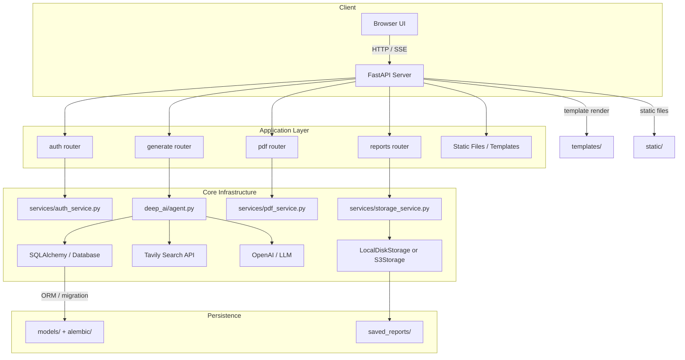
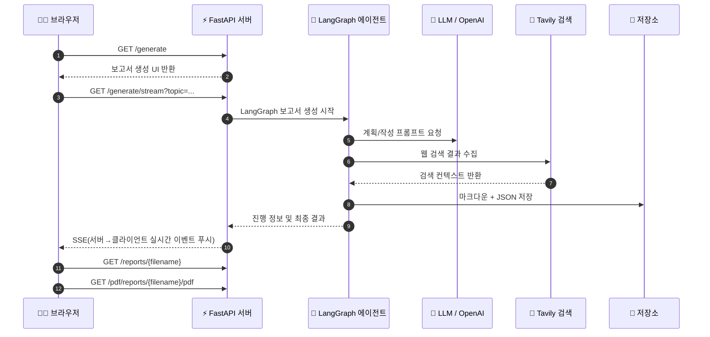

# 프로젝트 아키텍처 개요

Multi Agentic DeepResearcher는 FastAPI 기반 웹 애플리케이션과 LangGraph 기반 다중 에이전트 파이프라인을 결합한 구조입니다. 사용자는 브라우저를 통해 보고서 생성 요청을 제출하고, 백엔드가 인증, AI 에이전트, 웹 검색, 스토리지, PDF 변환을 조합하여 최종 리포트를 생성합니다.

## 아키텍처 다이어그램

## 🔄 시퀀스 다이어그램

## 🧭 라우터별 엔드포인트

| 라우터 | HTTP 메서드 및 경로 | 설명 |
| ------ | ------------------ | ---- |
| `auth` | `GET /auth/login` | 🔐 로그인 페이지 제공 |
| `auth` | `POST /auth/login` | 🔑 이메일/비밀번호 로그인 처리 |
| `auth` | `POST /auth/signup` | 📝 회원가입 처리 |
| `auth` | `POST /auth/logout` | 🚪 로그아웃 및 쿠키 삭제 |
| `generate` | `GET /generate` | 🌐 보고서 생성 UI 렌더링 |
| `generate` | `GET /generate/stream` | 📡 SSE(서버→클라이언트 실시간 이벤트 푸시) 스트리밍 |
| `reports` | `GET /dashboard` | 📊 저장된 보고서 목록 및 대시보드 |
| `reports` | `POST /settings/apikeys` | 🔐 API 키 저장 |
| `reports` | `POST /settings/preferences` | ⚙️ 언어 및 모델 설정 저장 |
| `reports` | `GET /reports/{filename:path}` | 📄 개인 보고서 보기 |
| `reports` | `POST /reports/{filename:path}/delete` | 🗑️ 보고서 삭제 |
| `pdf` | `POST /pdf/generate` | 📄 마크다운으로 PDF 생성 |
| `pdf` | `GET /pdf/reports/{filename:path}/pdf` | 📥 저장된 보고서 PDF 다운로드 |
| `pdf` | `GET /pdf/reports/{filename:path}/markdown` | 🧾 저장된 마크다운 다운로드 |

### 1. `main.py`
- 전체 FastAPI 애플리케이션 진입점
- `lifespan` 이벤트에서 스토리지 버킷 생성 및 LangGraph 체크포인터 초기화
- 라우터 등록: `auth`, `reports`, `generate`, `pdf`
- 정적 파일과 템플릿 디렉터리 마운트

### 2. `core/`
- `config.py`: 환경 변수 기반 설정 관리
- `database.py`: SQLAlchemy 엔진과 세션 팩토리 생성
- `dependencies.py`: 사용자 인증/세션 종속성 정의
- `__init__.py`: 빈 패키지 초기화

### 3. `deep_ai/`
- `agent.py`: LangGraph 기반 보고서 생성 파이프라인 정의
  - 보고서 계획 수립
  - 섹션별 검색 쿼리 생성
  - 웹 검색 수행
  - 섹션 작성 및 최종 보고서 컴파일
  - 체크포인터 초기화(여기서 MySQL 또는 SQLite 기반 LangGraph 체크포인터 사용)
- `prompts.py`: 다양한 에이전트 프롬프트 템플릿 정의
- `util.py`: 검색 결과 포맷팅 및 외부 API 호출 유틸리티

### 4. `services/`
- `auth_service.py`: JWT 로그인/회원관리, 비밀번호 해시, 인증 토큰 처리
- `storage_service.py`: 로컬 디스크 또는 AWS S3 저장소 추상화
- `pdf_service.py`: ReportLab 기반 PDF 변환 서비스

### 5. `routers/`
- `auth.py`: 로그인, 회원가입, 세션 흐름
- `reports.py`: 저장된 보고서 목록 조회 및 다운로드
- `generate.py`: AI 보고서 생성 요청 처리, SSE 스트리밍
- `pdf.py`: PDF 생성 및 제공

### 6. `models/`
- `user.py`: 사용자 모델 정의
- `report.py`: 보고서 메타데이터 모델 정의

### 7. `templates/` 및 `static/`
- `templates/`: Jinja2 템플릿을 사용한 서버 사이드 렌더링 UI
- `static/`: 클라이언트 사이드 JavaScript, CSS, 폰트

## 데이터 흐름 요약

1. 사용자가 브라우저에서 보고서 주제 입력 후 생성 요청
2. FastAPI가 인증 확인 후 `generate` 라우터로 요청 전달
3. `deep_ai/agent.py`가 LangGraph 상태 그래프 실행
   - 보고서 구조 계획 생성
   - 연구 필요 섹션 목록 결정
   - 각 섹션에 대해 검색 쿼리 생성
   - Tavily 검색 실행 후 섹션 콘텐츠 작성
   - 서론/결론 생성 및 최종 마크다운 합성
4. 생성된 결과를 로컬 또는 S3에 저장하고 DB에 메타데이터 기록
5. 클라이언트에 SSE(서버→클라이언트 실시간 이벤트 푸시)로 진행 상태를 스트리밍하고 최종 결과 제공

## 저장 및 체크포인트

- `services/storage_service.py`는 로컬 저장(`saved_reports/`)과 AWS S3 저장을 모두 지원
- `deep_ai/agent.py`는 LangGraph 체크포인터를 초기화하여 에이전트 상태를 지속
- `core/database.py`는 SQLAlchemy와 Alembic 기반 DB 연결을 관리

## 설계 특징

- **모듈 분리**: 인증, 스토리지, PDF, AI 에이전트가 각기 분리되어 유지보수가 쉽습니다.
- **LangGraph 에이전트**: 보고서 생성은 상태 그래프 기반으로 구성되어 연속성과 재실행이 가능합니다.
- **실시간 피드백**: SSE 스트리밍으로 생성 진행을 사용자에게 실시간 전달합니다.
- **환경별 스토리지**: 로컬 개발과 프로덕션 S3 스토리지 전환이 설정 기반으로 가능합니다.

